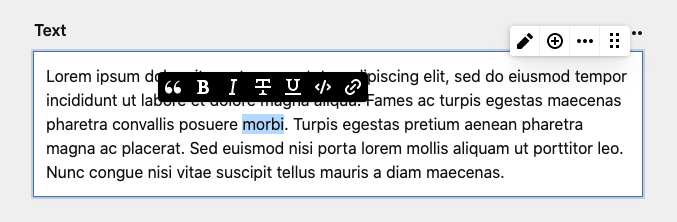

# Custom Writer Field Marks

This repository serves as a plugin boilerplate for extending the [writer field](https://getkirby.com/docs/reference/panel/fields/writer) with **custom marks** until Kirby natively supports them.

One of the beauties of open source is ideas are thrown out into the world to be picked up and improved upon in exchange. An older version of this plugin relied on a patcher for the panel. [Roman Steiner](https://github.com/rasteiner) found a way to free it from the patcher, culminating in his clever [Oh Hi Mark plugin](https://github.com/rasteiner/oh-hi-mark)! Based on his approach I reworked my plugin boilerplate, without making use of the prototype hack.

## Installation

> ℹ️ Since this repo is a plugin template, I recommend you fork it and include it manually into your `site/plugins` folder.

### Download

Download and copy this repository to `/site/plugins/kirby-writer-marks`.

### Git submodule

```
git submodule add https://github.com/johannschopplich/kirby-writer-marks.git site/plugins/kirby-writer-marks
```

## Usage

This plugin adds a custom **footnote mark**, which will create a `<article-footnote>` custom element. Styling included.

You can create custom plugins yourself. To get inspiration, head over to Kirby's official [writer marks](https://github.com/getkirby/kirby/tree/master/panel/src/components/Writer/Marks).

Custom marks are located in [`src/Marks`](./src/Marks) and initiate inside [`src/index.js`](./src/index.js).

### Development

> ℹ️ [kirbyup](https://github.com/johannschopplich/kirbyup) is used for building the Kirby Panel plugin.

Spin up the development server to watch your main script. You will have to refresh the Panel manually to see your new custom marks in the writer field.

```bash
npm run dev
```

### Production

Build the final Panel plugin:

```bash
npm run build
```

## Credits

- [Roman Steiner](https://github.com/rasteiner) for his inspirational [Oh Hi Mark plugin](https://github.com/rasteiner/oh-hi-mark)

## License

[MIT](./LICENSE) License © 2021 [Johann Schopplich](https://github.com/johannschopplich)
